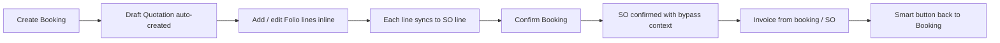

# Hotel Management System — Customization Log

This document records the customizations made to the Slow Resort hotel stack on **Odoo 18**, what problem each change solved, and how it was implemented.

**Modules involved:**

| Module | Role |
|--------|------|
| `hotel_management_system` | Base Webkul hotel module (booking lifecycle, availability, SO/invoicing) |
| `hotel_management_system_extend` | Slow Resort customizations (folio UX, guest counts, booking-first sales sync) |

**Current extend version:** `18.0.1.0.13`

**Related planning doc:** [`HOTEL_SALES_INVOICING_SHIFT_PLAN.md`](../HOTEL_SALES_INVOICING_SHIFT_PLAN.md) — future work to move more sales/invoicing off the Sales app.

---

## Goals

1. Make the **booking (folio) the primary workspace** for front desk — not Sales quotations.
2. Allow **rooms, bookable services, and regular products** on one inline folio list.
3. Keep **sale orders and invoices** in sync automatically for payments and accounting.
4. Simplify guest entry with **count fields** instead of manual member rows.
5. Fix bugs that blocked confirm, quantity editing, line deletion, and invoice navigation.

---

## Architecture: booking-first flow



| Step | What happens |
|------|----------------|
| Booking create | `_ensure_hotel_quotation()` creates a **draft** `sale.order` and links it as `order_id` |
| Folio line create/edit | `_ensure_sale_order_lines()` creates or updates the matching `sale.order.line` |
| Folio line delete | Linked SO line is removed; orphans are cleaned up |
| Confirm booking | Existing quotation is confirmed with `from_hotel_booking_confirm=True` so base logic does not recreate booking lines |

---

## 1. Inline Folio product selection

### Before
Three separate buttons on the Folio tab opened wizards:
- **Add Rooms**
- **Add Services**
- **Add Other Products**

### After
One **editable list** (`editable="bottom"`) on the Folio tab. Staff click **Add a line**, pick a product inline, and fill qty/guest columns.

### Product categories in one list

| Product type | Product flags | Qty behaviour | Guest columns shown |
|--------------|---------------|---------------|---------------------|
| **Room** | `is_room_type=True` | Auto (nights from stay dates) | Adults, children, infants |
| **Bookable service** | `is_bookable=True`, not room | Auto (adults + children + drivers + infants) | Adults, children, drivers |
| **Other product** | not bookable, not room | **Manual qty** (`booking_days`) | Hidden (defaults to 0) |

### How it was done

1. **`folio_product_ids`** (computed on `hotel.booking`) builds the allowed product set:
   - Available rooms for hotel + check-in/out (+ rooms already on this folio)
   - Active bookable services (`sale_ok`)
   - Active other sale products (not bookable, not room)

2. **`allowed_product_ids`** (related on `hotel.booking.line`) drives the product dropdown domain.

3. **`_onchange_folio_product_id`** and **`_check_folio_product_selection`** validate product choice and set defaults per product type.

4. **View** (`hotel_booking_add_room_views.xml`) replaces the Folio page: removed wizard buttons, added inline list with `sol_product_many2one` widget for product search UX.

### Files
- `models/hotel_booking.py` — `folio_product_ids`, `_get_folio_available_product_ids()`
- `models/hotel_booking_line.py` — onchange, constraints, product helpers
- `views/hotel_booking_add_room_views.xml`

---

## 2. Guest count fields (replacing Members tab)

### Problem
Base module expects `guest.info` records per line. Manually filling the **Members Details** tab was slow.

### Solution
Added count fields on `hotel.booking.line`:
- `adult_count`, `child_count`, `infant_count`, `driver_count`

`guest.info` rows are **auto-generated** from counts via `guest_member_utils.sync_guest_info_records()` so base confirm validation still works.

The **Members Details** tab is hidden in the UI; guest columns on the folio list show/hide based on product type.

### Files
- `models/hotel_booking_line.py`
- `models/guest_member_utils.py`
- `models/sale_order_line.py` — guest count fields on SO lines
- `views/hotel_booking_add_room_views.xml`

---

## 3. Booking-first sale order sync

### Problem
Base flow created/confirmed sale orders mainly at booking confirm. Staff needed a linked quotation from the moment a booking exists.

### Solution

**On booking create** (`hotel.booking.create` in extend):
```python
manual_bookings._ensure_hotel_quotation()
```

**On each folio line** (`hotel.booking.line`):
- `_prepare_sale_order_line_vals()` — builds SO line values from booking line
- `_ensure_sale_order_lines()` — creates missing SO lines and sets `sale_order_line_id`

**On confirm** (`action_confirm_booking` in extend):
- Uses existing `order_id` quotation
- Confirms with context `from_hotel_booking_confirm=True`

### Fix: FK error on Confirm Booking

**Error:**
```
hotel_booking_line_sale_order_line_id_fkey
```

**Cause:** Base `sale.order.action_confirm()` tried to delete and recreate booking lines when a booking already existed.

**Fix** in `hotel_management_system/models/sale_order.py`:
```python
if self.env.context.get("from_hotel_booking_confirm"):
    return super().action_confirm()
```

Extend passes that context when confirming from the booking form.

### Files
- `models/hotel_booking.py` — `_ensure_hotel_quotation`, extended `action_confirm_booking`
- `models/hotel_booking_line.py` — `_ensure_sale_order_lines`, `_prepare_sale_order_line_vals`
- `hotel_management_system/models/sale_order.py` — confirm bypass

---

## 4. Folio line deletion → sale order sync

### Problem
Removing a line from the Folio left the product on the linked **sale order**. Sometimes a new SO line was even recreated after delete.

### Cause
Clearing `sale_order_line_id` or deleting the SO line triggered `hotel.booking.line.write()`, which called `_ensure_sale_order_lines()` and **created a replacement SO line** before the folio line was fully removed.

### Solution

1. **`skip_ensure_sale_order_lines` context** — skips auto-create during unlink/cleanup operations.

2. **`write()` guard** — do not call `_ensure_sale_order_lines()` when `sale_order_line_id` is being cleared:
   ```python
   clearing_so_link = "sale_order_line_id" in vals and not vals.get("sale_order_line_id")
   if not self.env.context.get("skip_ensure_sale_order_lines") and not clearing_so_link:
       self._ensure_sale_order_lines()
   ```

3. **`_break_sale_order_line_link()`** — clears the FK with SQL so ORM `write()` does not fire and recreate lines:
   ```python
   UPDATE hotel_booking_line SET sale_order_line_id = NULL WHERE id = ANY(...)
   ```

4. **`unlink()` flow** on `hotel.booking.line`:
   - Wrap in `skip_ensure_sale_order_lines` + `bypass_for_exchange_room` context
   - Break SO link → delete SO lines → delete folio lines
   - Call **`_cleanup_orphan_sale_order_lines()`** on the parent booking as a safety net

5. **`_cleanup_orphan_sale_order_lines()`** on `hotel.booking` — removes any SO lines on the quotation that are no longer linked to a folio line.

### Files
- `models/hotel_booking_line.py` — `_break_sale_order_line_link`, `_unlink_linked_sale_order_lines`, `unlink`, `write`
- `models/hotel_booking.py` — `_cleanup_orphan_sale_order_lines`

---

## 5. Editable quantity for other products

### Problem
Qty on non-room, non-bookable products was readonly or reset after save because `booking_days` was a non-stored computed field overwritten on every recompute.

### Solution

1. **`booking_days`** on extend lines is **stored**, **computed with inverse**, and **`readonly=False`**.

2. **`_compute_booking_days`** skips other products so manual qty is never overwritten:
   ```python
   lines_for_super = self.filtered(lambda l: not _is_other_product(l.product_id))
   super(..., lines_for_super)._compute_booking_days()
   # other products: continue without overwriting
   ```

3. **`_inverse_booking_days`** — for other products only, persists qty and syncs to SO line.

4. **View readonly rule** uses related fields that update immediately in the UI:
   ```xml
   readonly="not product_id or product_is_room_type or product_is_bookable"
   ```

5. **`is_other_product_line`** is a **non-stored** computed flag (stored version blocked qty editing on new rows until save).

6. Removed **`sol_o2m`** widget from folio list — it is designed for `sale.order.line` and interfered with editing on `hotel.booking.line`.

### Files
- `models/hotel_booking_line.py` — `booking_days`, inverses, onchanges, related flags
- `views/hotel_booking_add_room_views.xml`

---

## 6. Minimum 1-night billing

### Problem
Same-day check-in/check-out produced `booking_days = 0` and zero-priced room lines.

### Solution
If check-in and check-out fall on the same calendar day, `booking_days` is set to **1**.

Post-init hook recomputes existing records after install/upgrade.

### Files
- `models/hotel_booking.py`
- `models/hotel_booking_line.py`
- `hooks.py`

---

## 7. Invoice → Booking smart button

### Problem
Invoices linked to hotel bookings showed no working smart button to open the source booking.

### Solution (base module patch)
- `booking_count` on `account.move` is computed from `hotel_booking_id` or linked sale orders
- `action_view_source_booking()` opens the booking form
- Button uses bed icon and shows count

### Files
- `hotel_management_system/models/account_move.py`
- `hotel_management_system/views/account_view.xml`

---

## 8. Product model: `is_bookable` flag

### Change
Added **`is_bookable`** on `product.template` (and related on `product.product`).

- Room types auto-set `is_bookable=True` via onchange
- Used to distinguish **bookable services** (capacity/guest-based qty) from **regular sale products** (manual qty)

### Files
- `models/product.py`
- `views/product_views.xml`

---

## 9. UI and label changes

| Before | After |
|--------|-------|
| Folio column "Rooms" | **Product Variant** |
| Three add buttons | Inline **Add a line** |
| Members Details tab | Hidden; counts on folio list |
| `sol_o2m` widget on folio | Standard editable list |

---

## 10. Other extend features (pre-existing)

These were in the extend module before the folio rework and remain active:

- Sale order tax totals show **paid amount** and **balance**
- Portal / report template tweaks
- Check-in/out time normalization (`checkin_utils.py`) for midnight-only date picks
- Dashboard calendar uses bookable products only
- Payment registration and email fixes

---

## Technical reference: context flags

| Context key | Purpose |
|-------------|---------|
| `from_hotel_booking_confirm` | Skip destructive SO→booking sync on confirm |
| `skip_ensure_sale_order_lines` | Prevent SO line recreation during unlink/cleanup |
| `bypass_for_exchange_room` | Skip base booking-line ↔ SO sync loop |
| `bypass_checkin_checkout` | Skip check-in/out validation on SO writes |

---

## File map (extend module)

```
hotel_management_system_extend/
├── EXTEND_CUSTOMIZATIONS.md              ← this file
├── __manifest__.py                       ← version 18.0.1.0.13
├── hooks.py                              ← recompute booking_days on install
├── models/
│   ├── hotel_booking.py                  ← quotation, folio products, confirm, orphan cleanup
│   ├── hotel_booking_line.py             ← guest counts, qty, SO sync, unlink
│   ├── guest_member_utils.py             ← guest sync / validation helpers
│   ├── product.py                        ← is_bookable flag
│   ├── sale_order.py                     ← tax totals, invoice link
│   └── sale_order_line.py                ← guest counts on SO lines
├── views/
│   ├── hotel_booking_add_room_views.xml  ← Folio tab inline list
│   ├── product_views.xml
│   └── sale_order_views.xml
└── migrations/                           ← post-migrate scripts per version
```

**Base module files also patched:**

```
hotel_management_system/
├── models/sale_order.py      ← from_hotel_booking_confirm bypass
└── models/account_move.py    ← invoice booking smart button
```

---

## Upgrade steps

After pulling changes:

```bash
-u hotel_management_system,hotel_management_system_extend
```

Restart Odoo if needed, then hard-refresh the browser (Ctrl+Shift+R).

---

## Staff guide: using the Folio tab

1. Create or open a booking in **Initial** state
2. Set **guest**, **hotel**, **check-in**, **check-out**, **pricelist**
3. Open the **Folio** tab
4. Click **Add a line**
5. Choose **Product Variant** (room, service, or other product)
6. Fill guest columns or qty as applicable
7. **Save** the booking
8. Click **Confirm Booking** when ready

### Rules

- Folio is **readonly** after confirm (not Initial)
- **Rooms** — qty follows stay length; only available rooms appear
- **Services** — qty follows guest/driver counts
- **Other products** — qty is editable
- Same room cannot appear twice on one folio
- Deleting a folio line removes it from the linked quotation

---

## Troubleshooting

| Issue | What to check |
|-------|----------------|
| No products in dropdown | Product must be `sale_ok`, active, and match room/service/other rules |
| No rooms in dropdown | Hotel + dates set; room may be booked elsewhere |
| Confirm booking FK error | Upgrade `hotel_management_system` (confirm context fix) |
| Qty not editable | Product is room or bookable service (auto qty); booking must be Initial |
| Deleted folio line still on SO | Upgrade extend to 18.0.1.0.13+; re-save or delete line again |
| Invoice smart button missing | Invoice needs `hotel_booking_id` or SO linked to booking |
| Guest validation on confirm | Counts must be filled for room lines; `guest.info` is auto-synced |

---

## Known items not yet fixed

These exist in the base module and are documented for future work:

- Agent commission check uses `'via_agent'` instead of `'agent'` in base confirm
- `validate_guest()` does not enforce `max_occupancy` on confirm (UI warning only)
- Broader **booking-centric invoicing** shift — see [`HOTEL_SALES_INVOICING_SHIFT_PLAN.md`](../HOTEL_SALES_INVOICING_SHIFT_PLAN.md)

---

*Last updated: July 2026 — includes inline folio, qty editing, folio→SO delete sync, and confirm/invoice fixes.*
