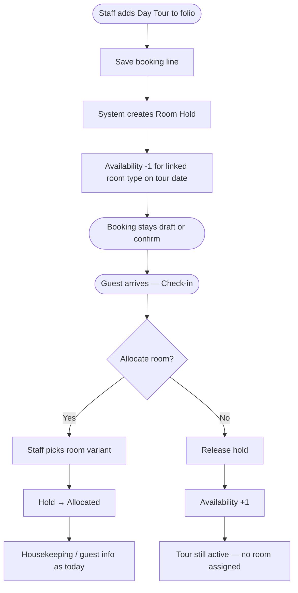
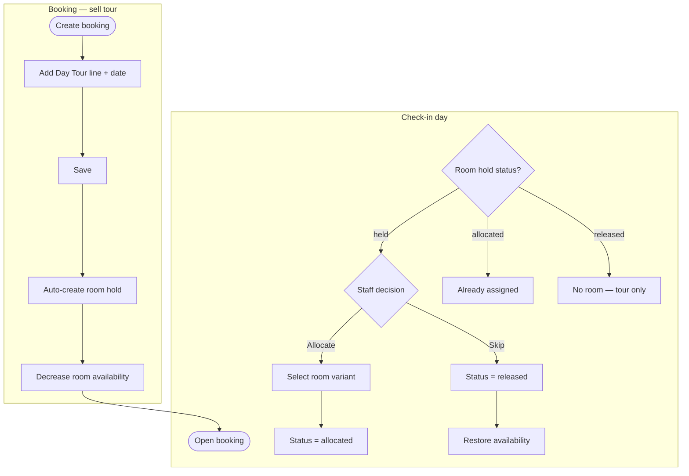

# Day-Long Tour → Room Hold → Optional Allocation

**Status:** Planning only (fresh start from business example)  
**Scope:** Slow Resort — Odoo 18 `hotel_management_system_extend`

---

## 1. Business example (your criteria)

> Guest books a **day-long tour** (`is_bookable = True`).  
> That booking **holds a room** (`is_bookable = True` **and** `is_room_type = True`).  
> **Available room count goes down** immediately.  
> At **check-in**, staff **decides** whether to actually allocate that room or not.

This is **not** the same as booking an overnight stay. It is:

| Step | What happens | Who decides |
|------|----------------|-------------|
| **1. Sell tour** | Staff adds day tour to folio | Front desk |
| **2. Hold room slot** | System reserves 1 room unit for tour date | Automatic |
| **3. Reduce availability** | Other bookings see fewer rooms free | Automatic |
| **4. Check-in** | Staff chooses: allocate room **or** release hold | Front desk |

---

## 2. Core concepts

### 2.1 Two different meanings of “room booked”

```text
┌─────────────────────┐         ┌─────────────────────┐
│  ROOM HOLD          │         │  ROOM ALLOCATION    │
│  (inventory)        │         │  (operations)       │
├─────────────────────┤         ├─────────────────────┤
│ When tour is saved  │         │ When guest arrives  │
│ Reduces availability│         │ Staff assigns room  │
│ No specific room yet│         │ May skip entirely   │
│ Linked to tour line │         │ Housekeeping, keys  │
└─────────────────────┘         └─────────────────────┘
```

- **Hold** = capacity is consumed (fewer “available” rooms).
- **Allocation** = optional physical assignment at check-in.

### 2.2 Product roles (using existing flags)

| Product | is_room_type | is_bookable | Role in this flow |
|---------|:------------:|:-----------:|-------------------|
| **Island Day Tour** | No | Yes | What staff sells on the folio |
| **Tour Cabana / Day Room** | Yes | Yes | Room type whose **inventory** is held (not sold separately) |

You **do not** need new flags like `is_room_type` or `is_bookable` — they stay as today.

You **do** need new configuration linking tour → room type, and a **hold/allocation state**.

---

## 3. Example walkthrough

**Setup (admin, once):**

- Product **“Island Day Tour”** — `is_bookable`, not `is_room_type`
- Product **“Day Tour Cabana”** — `is_room_type` + `is_bookable`
- On the tour: **“Reserves room type”** = Day Tour Cabana, **qty** = 1 per tour booking

**Staff books:**

1. Create draft booking, guest + tour date (e.g. Fri 14 Jul).
2. Add folio line: **Island Day Tour**, qty = 4 guests (or 1 tour — your pricing rule).
3. **On save:** system creates a linked **room hold** for **Day Tour Cabana** on Fri 14 Jul.
4. Availability for that room type on that date: was 10 → now **9**.

**Check-in day:**

| Staff choice | System behaviour |
|--------------|------------------|
| **Allocate room** | Pick variant (e.g. Cabana A), status → allocated, guest gets room |
| **Do not allocate** | Hold released, availability back to 10, tour still valid |

Guest paid for the **tour**; the room was always a **conditional** operational benefit, not a guaranteed overnight stay.

---

## 4. Recommended architecture



### 4.1 Data model (proposed)

**A. Tour product config** (`product.template`)

| New field | Purpose |
|-----------|---------|
| `is_day_long_tour` | Marks tour products that trigger a room hold |
| `reservation_room_product_id` | Room **type** to hold (must be `is_room_type` + `is_bookable`) |
| `hold_qty_per_tour` | Usually 1; or derive from guest count |

**B. Room hold record** (new model recommended: `hotel.room.hold`)

| Field | Purpose |
|-------|---------|
| `booking_id` | Parent booking |
| `tour_line_id` | Folio line that created the hold |
| `room_product_id` | Room type held (e.g. Day Tour Cabana) |
| `hold_date` | Tour date (single day) |
| `state` | `held` → `allocated` or `released` |
| `allocated_line_id` | Optional link to `hotel.booking.line` when room assigned |
| `allocated_product_id` | Specific room variant if allocated |

**Why a separate model instead of only a hidden folio line?**

- Clear **state machine** (held / allocated / released)
- Availability logic counts holds without treating them as full room stays
- Check-in UI can show “pending allocation” tours cleanly
- Releasing hold does not delete the tour line

**C. Folio line** (`hotel.booking.line`) — tour line only

Staff only add the **tour** visibly. Room hold is **system-generated** (linked, not a second manual line unless you want it visible read-only).

Optional read-only column on folio: **“Room hold”** → Held / Allocated / Released.

---

## 5. Availability logic

Today: availability uses overlapping **booking lines** with room products and booking check-in/out.

**New rule:**

```text
Available(room_type, date) =
    Total physical units
    − Overnight bookings overlapping date
    − Room HOLDS for that room_type on that date (state = held or allocated)
```

- **Held** counts against availability (your requirement).
- **Released** does not count.
- **Allocated** still counts (room is in use).

---

## 6. Check-in UI (staff)

On booking check-in (or dedicated action per tour line):

```text
Tour: Island Day Tour — Fri 14 Jul
Room hold: Day Tour Cabana — status: HELD

[ Allocate room ]   [ Release hold — no room today ]
```

**Allocate room** opens room picker (available variants for that date) → creates/updates allocation.

**Release hold** → state `released`, availability restored, no room assignment.

---

## 7. Flowchart — full process



---

## 8. What we are NOT doing in this scope

- Per-line overnight dates for split stays (separate topic)
- Max 2 / max 5 night rules (separate topic)
- Generic service dependency engine (can come later)
- Staff manually adding the hold room as a normal overnight line (hold is **automatic**)

---

## 9. Existing fields — reuse

| Field | Use in this flow |
|-------|------------------|
| `is_bookable` | Tour = yes; hold room type = yes |
| `is_room_type` | Hold room type = yes; tour = no |
| `is_day_long_tour` | **New** — triggers hold on save |
| `reservation_room_product_id` | **New** — which room type to hold |

---

## 10. Implementation phases

| Phase | Deliverable |
|-------|-------------|
| **1** | Product link: tour → room type; `is_day_long_tour` |
| **2** | `hotel.room.hold` model + auto-create on tour line save |
| **3** | Availability includes holds |
| **4** | Check-in actions: Allocate / Release |
| **5** | Folio read-only hold status; SO sync (tour line only on quotation) |

---

## 11. Decisions to confirm

| # | Question | Default suggestion |
|---|----------|-------------------|
| 1 | One hold per tour line or per guest? | **1 hold per tour booking** (1 room slot) |
| 2 | Show hold on folio? | **Read-only row or status column** |
| 3 | Hold room on quotation/SO? | **No** — only tour is billed; hold is operational |
| 4 | Release hold if tour line deleted? | **Yes** — restore availability |
| 5 | Can staff allocate a *different* room type? | **No** — only linked type unless admin override |

---

*This document replaces earlier folio validation assumptions for the day-tour + room-hold use case. See `HOTEL_FOLIO_VALIDATION_PLAN.md` for archived broader ideas.*
