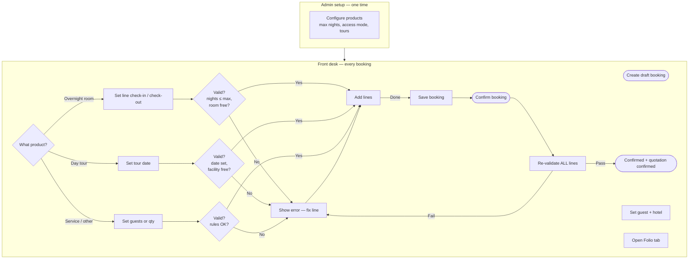
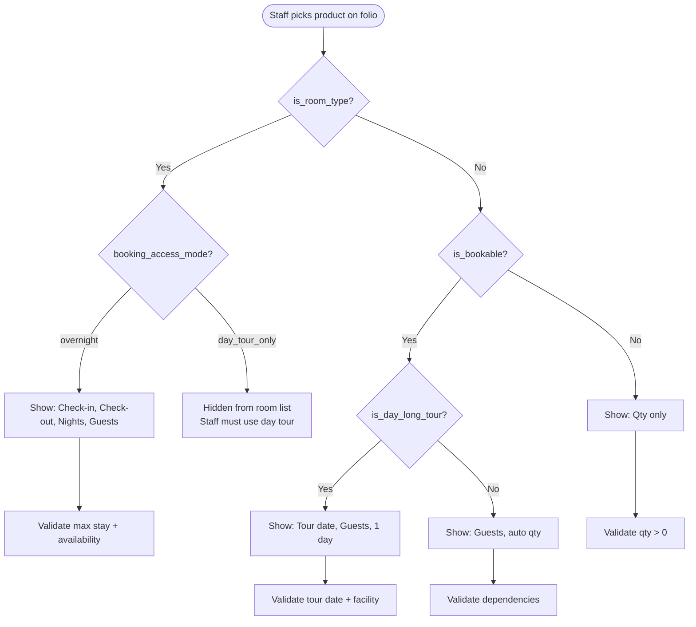
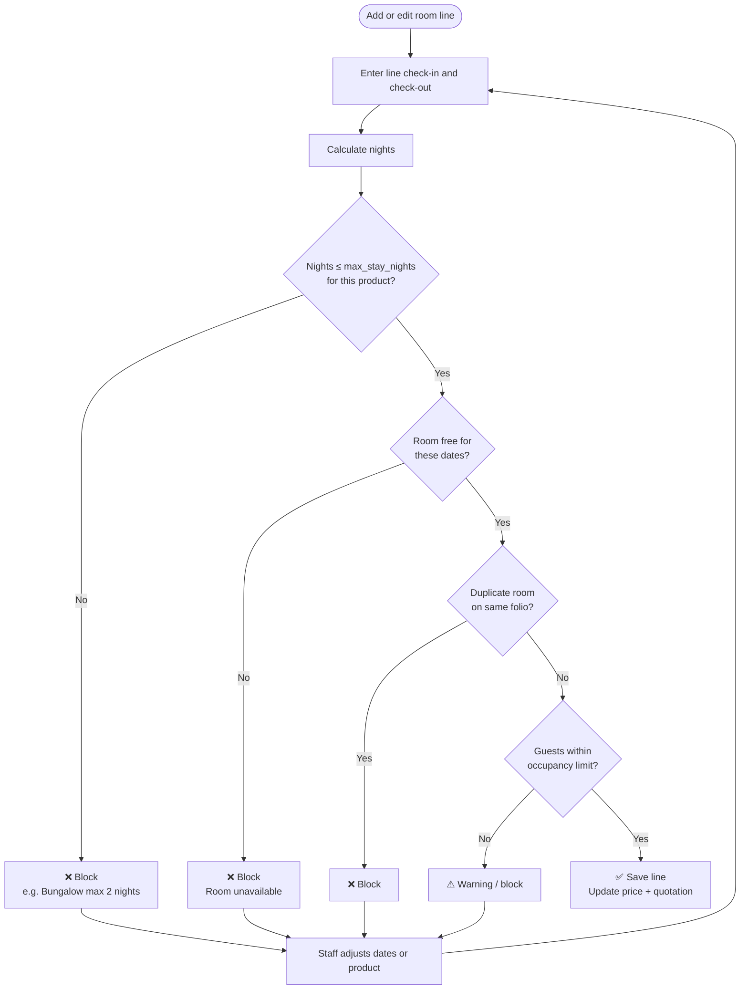
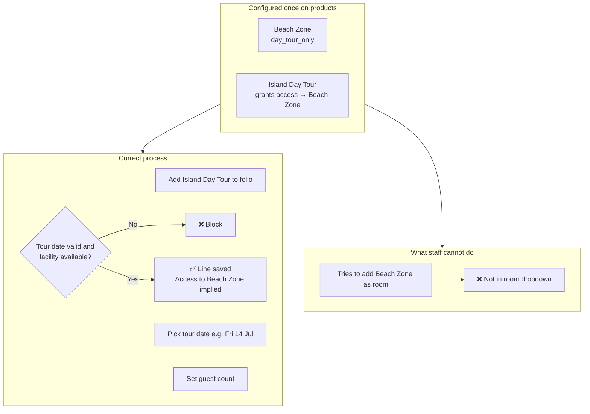
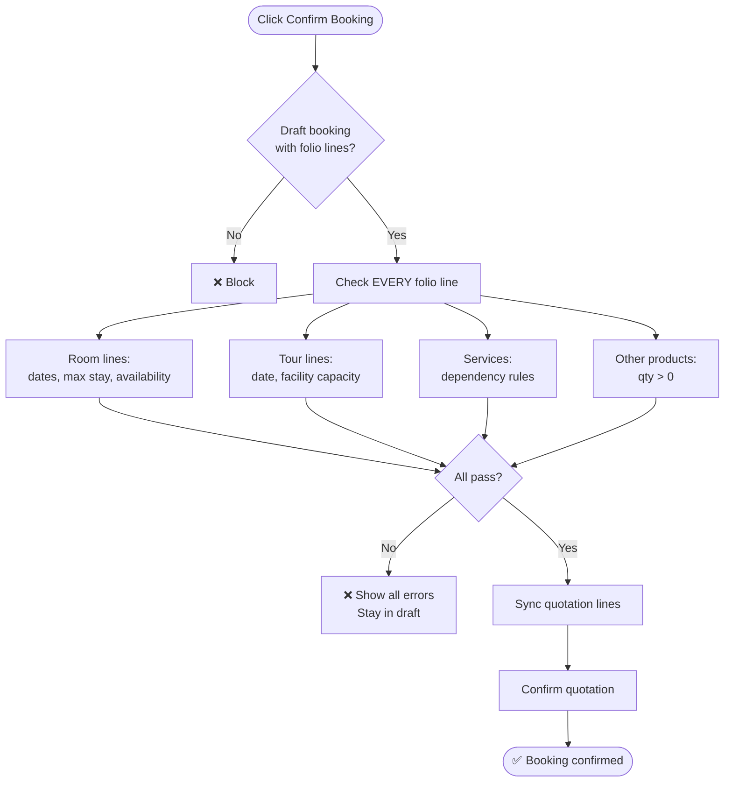
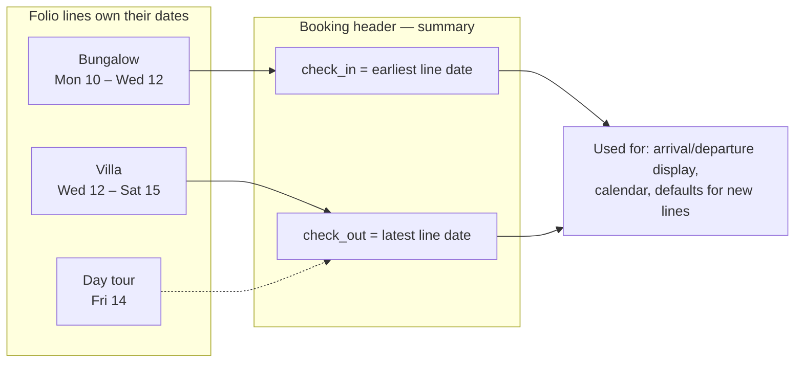

# Slow Resort — Folio Validation Plan (Executive Brief)

**Purpose:** Explain the planned booking rules to staff, management, and developers.  
**Status:** Planning only — no code deployed yet.  
**Detailed technical doc:** [`HOTEL_FOLIO_VALIDATION_PLAN.md`](HOTEL_FOLIO_VALIDATION_PLAN.md)

---

## 1. What we are solving

Today, one booking has **one check-in and one check-out** for all rooms. That does not match how Slow Resort operates.

| Business need | Example |
|---------------|---------|
| **Different rooms, different dates** | Bungalow Mon–Tue, then Villa Wed–Sat on the same reservation |
| **Max stay per room type** | Standard room max **2 nights**; Villa max **5 nights** |
| **Day-access facilities** | Private Beach Zone is **not** an overnight room — guest books a **day tour** |
| **Service rules** | Some services require a room or another product on the folio |

**Goal:** One booking, one folio, one quotation — with smart validation per product type.

---

## 2. Product types (how Odoo will classify items)

We **keep** the flags you already have. We **add** a few new settings on products.

### 2.1 Existing fields (already built — do not recreate)

| Field | Module | Meaning |
|-------|--------|---------|
| **`is_room_type`** | Base | Product is a room or physical facility |
| **`is_bookable`** | Extend | Product is a reservable service (tours, spa, etc.) |

### 2.2 New fields (to be added)

**On room / facility products (`product.template`):**

| Field | Example: Bungalow | Example: Villa | Example: Beach Zone |
|-------|-------------------|----------------|---------------------|
| `booking_access_mode` | `overnight` | `overnight` | `day_tour_only` |
| `max_stay_nights` | **2** | **5** | — (not overnight) |
| `min_stay_nights` | 1 | 1 | — |

**On day tour products:**

| Field | Example: Island Day Tour |
|-------|--------------------------|
| `is_bookable` | Yes (existing) |
| `is_day_long_tour` | Yes (new) |
| `grants_access_product_ids` | Private Beach Zone (new) |

**On folio lines (`hotel.booking.line`):**

| Field | Used for |
|-------|----------|
| `line_check_in` / `line_check_out` | Each overnight room segment |
| `service_date` | Day tour or date-bound service |

### 2.3 Product type matrix (easy reference)

| Type | is_room_type | is_bookable | access_mode | Max nights | How staff adds it |
|------|:------------:|:-----------:|-------------|------------|-------------------|
| **Standard Bungalow** | Yes | Yes | overnight | 2 | Folio → room line + dates |
| **Villa** | Yes | Yes | overnight | 5 | Folio → room line + dates |
| **Beach Zone (facility)** | Yes | Yes | day_tour_only | — | **Not** as room — via tour only |
| **Island Day Tour** | No | Yes | — | 1 day | Folio → tour line + date |
| **Other minibar item** | No | No | — | manual qty | Folio → qty only |

---

## 3. One booking — example folio

Guest reservation envelope: **Mon 10 Jul → Sat 15 Jul**

```text
┌────────────────────────────────────────────────────────────────────┐
│  BOOKING #BK-001  │  Guest: John Smith  │  Hotel: Slow Resort      │
│  Header check-in: Mon 10 Jul    check-out: Sat 15 Jul (envelope)   │
├────────────────────────────────────────────────────────────────────┤
│  FOLIO LINES                                                       │
├──────────────────┬─────────────┬────────┬─────────┬──────────────────┤
│ Product          │ Check-in    │ Check-out│ Nights │ Validation     │
├──────────────────┼─────────────┼────────┼─────────┼──────────────────┤
│ Standard Bungalow│ Mon 10 Jul  │ Wed 12 │    2    │ OK (max 2)       │
│ Villa            │ Wed 12 Jul  │ Sat 15 │    3    │ OK (max 5)       │
│ Island Day Tour  │ Fri 14 Jul  │   —    │ 1 day   │ Unlocks Beach Zone│
└──────────────────┴─────────────┴────────┴─────────┴──────────────────┘
                              ↓
                    Draft quotation (sale order) stays in sync
```

---

## 4. Master flowchart — end to end

*Use this slide to explain the full journey.*



---

## 5. Flowchart — choosing a product (routing)

*Use this to explain why different lines show different columns.*



---

## 6. Flowchart — overnight room rules

*Use this for “max 2 nights / max 5 nights” discussion.*



**Key message:** Max stay applies **per room line**, not per whole booking.  
Bungalow 2 nights + Villa 3 nights on one folio = **allowed**.

---

## 7. Flowchart — day tour & day-access facility

*Use this for “Beach Zone via tour only” discussion.*



**Key message:** Staff sell the **tour**; the system handles **facility access** behind the scenes.

---

## 8. Flowchart — confirm booking gate

*Use this to explain what happens when front desk clicks Confirm.*



---

## 9. Header dates vs line dates

*Use this to explain “one booking but different room dates”.*



---

## 10. What changes for each role

| Role | Today | After implementation |
|------|-------|----------------------|
| **Admin** | Sets `is_room_type`, `is_bookable` | Also sets max nights, access mode, tour links |
| **Front desk** | One stay date for all rooms | **Per-line dates** on room rows; tour date for day tours |
| **Guest / portal** | Same booking summary | Clearer line descriptions with date ranges |
| **Finance** | Quotation from folio | Same flow — lines stay synced with correct qty/dates |

---

## 11. Implementation phases

| Phase | Deliverable | Business value |
|-------|-------------|----------------|
| **1** | Line dates + `max_stay_nights` | Bungalow 2d / Villa 5d enforced |
| **2** | `booking_access_mode` + hide day-only facilities from room list | Tour-only facilities work correctly |
| **3** | Day tour fields + `service_date` + facility capacity | Island Day Tour books Beach Zone |
| **4** | Service dependency rules (optional) | “Requires room” / “requires product X” |
| **5** | Reports, calendar, invoice line descriptions | Operations visibility |

**Recommended start:** Phase 1 + 2 together (rooms + access mode).

---

## 12. Decisions to confirm before build

| # | Question | Suggested answer |
|---|----------|------------------|
| 1 | Same room type twice on one folio? (Bungalow Mon–Tue + Thu–Fri) | **Yes** — each segment checked separately |
| 2 | Day tour without overnight room? | **Yes** — day visitors allowed |
| 3 | Gap nights between room segments? | **Allow + warn** on confirm |
| 4 | Facility capacity | **Open/closed per day** first; headcount later |

---

## 13. What we are NOT doing

- ❌ Creating new `is_bookable` / `is_room_type` — **already exist**
- ❌ Splitting one guest stay into multiple unrelated bookings
- ❌ Hard-coding rules in Python per product — rules live on **product config**
- ❌ Removing sale orders — quotation engine **stays**, folio remains source of truth

---

## 14. One-slide ASCII summary (for print / WhatsApp)

```text
SLOW RESORT FOLIO RULES
═══════════════════════

PRODUCT SETUP (Admin)
  Standard Bungalow  → overnight, max 2 nights
  Villa              → overnight, max 5 nights
  Beach Zone         → day_tour_only (no direct room booking)
  Island Day Tour    → grants access to Beach Zone

STAFF WORKFLOW
  1. Create draft booking
  2. Add folio lines:
     • Rooms     → pick dates PER LINE
     • Day tour  → pick TOUR DATE
     • Other     → pick qty
  3. System validates max nights + availability
  4. Confirm → all lines re-checked → quotation confirmed

REMEMBER
  • Max nights = per room LINE, not whole booking
  • Beach Zone = book the TOUR, not the facility as a room
  • is_bookable + is_room_type stay as they are today
```

---

*For full technical architecture, field specs, and extended flowcharts see [`HOTEL_FOLIO_VALIDATION_PLAN.md`](HOTEL_FOLIO_VALIDATION_PLAN.md) Section 13.*
