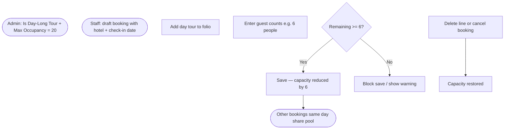

# Hotel Management System Extend — Features Review

**Module:** `hotel_management_system_extend`  
**Odoo version:** 18.0  
**Status:** Day-long tour Option 1 + dashboard occupancy (v18.0.1.0.19)  
**Last updated:** July 2026

---

## Purpose

This document captures agreed business rules and implementation notes for Slow Resort. It is the reference for day-long tour capacity (Option 1) and future room-hold / allocation work.

**Related planning doc:** `[HOTEL_DAY_TOUR_ROOM_HOLD_PLAN.md](HOTEL_DAY_TOUR_ROOM_HOLD_PLAN.md)`

---

## Confirmed business decisions

| #   | Question                             | Decision                                                                                      |
| --- | ------------------------------------ | --------------------------------------------------------------------------------------------- |
| 1   | How is day-tour capacity configured? | **Max occupancy only** on the product (Day-Long Tour config tab)                              |
| 2   | How is capacity consumed on booking? | **Total guests on the folio line** reduce remaining occupancy (Option 1 — tour capacity pool) |
| 3   | Bill only the tour on the quotation? | **Yes** — day-long tours behave like other bookable services on the SO                        |
| 4   | Room hold / allocation at check-in?  | **Not in this phase** — deferred; see [Future phases](#future-phases)                         |

---

## Implemented: Day-long tour capacity (Option 1)

### Business story

1. Admin marks a product as **Is Day-Long Tour** and sets **Max Occupancy** (e.g. 20).
2. Staff adds that tour to a booking **folio** with guest counts (adults, children, infants, drivers).
3. On **save**, the system checks that total guests on the line do not exceed **remaining capacity** for:

- that **tour product**
- the booking **check-in calendar date**
- the booking **hotel**

4. Other bookings on the same date/hotel/tour **share the same pool** — capacity is reduced by their guest totals too.
5. **Deleting** a tour line or **cancelling** a booking restores capacity (those lines no longer count).

**Active booking states that consume capacity:** `initial` (draft), `confirm`, `allot`.  
**Released when cancelled or checked out:** `cancel`, `checkout` — capacity is freed immediately, including before duplicating a cancelled booking.

### Why Option 1 (not room hold yet)

| Approach                                            | Choice                                                                             |
| --------------------------------------------------- | ---------------------------------------------------------------------------------- |
| **Option 1 — Tour capacity pool**                   | **Implemented now** — simple admin config (max occupancy only), guest-count driven |
| Option 2 — Link tour to room type inventory         | Deferred                                                                           |
| `hotel.room.hold` model + check-in allocate/release | Deferred                                                                           |

Option 1 matches the requirement: _“On the config tab I only want max occupancy; on booking, depending on total number of people, occupancy will be reduced.”_ No room-type link or hold record is required for this release.

### How capacity is calculated

```text
Booked guests (tour T, date D, hotel H) =
    SUM(adults + children + infants + drivers)
    on all folio lines for product T where:
      - booking.hotel_id = H
      - booking.check_in date = D
      - booking.status_bar NOT IN (cancel, checkout)

Remaining capacity = day_tour_max_occupancy − booked guests
```

**Tour date rule:** uses the booking **check-in date** (calendar day), not check-out.

**Guest count rule:** `adult_count + child_count + infant_count + driver_count` on the folio line.

**Validation timing:** on folio line create/write (constraint) and when booking **check-in** or **hotel** changes. Onchange shows a **warning** before save.

### Product configuration

| Field                    | Model              | Purpose                                        |
| ------------------------ | ------------------ | ---------------------------------------------- |
| `is_day_long_tour`       | `product.template` | Enables day-long tour behaviour and config tab |
| `day_tour_max_occupancy` | `product.template` | Max guests per tour product per day per hotel  |

**UI**

- Checkbox **Is Day-Long Tour** next to **Is Bookable** (hidden for room types).
- Notebook page **Day-Long Tour** (visible when checkbox is on) with **Max Occupancy** only.

**Rules enforced on product**

- Day-long tour ⇒ must be **bookable**, must **not** be a **room type**.
- Max occupancy must be **≥ 1** when day-long tour is enabled.
- Turning on **room type** clears **day-long tour**.

### Booking / folio behaviour

| Behaviour            | Detail                                                                                           |
| -------------------- | ------------------------------------------------------------------------------------------------ |
| Product picker       | Day-long tours appear like other **bookable services** (`is_bookable`, not `is_room_type`)       |
| Guest fields         | Adults / children / infants / drivers (same as bookable services)                                |
| Qty / `booking_days` | Synced from total guest count (existing bookable-service logic)                                  |
| Folio column         | **Tour Capacity Left** — read-only remaining places after other bookings                         |
| Save blocked if      | No hotel, no check-in date, zero guests, line guests > max occupancy, or line guests > remaining |
| Quotation            | Tour line only — existing `_ensure_sale_order_lines` sync (no extra SO line for “hold”)          |

### Front Desk Dashboard (day-long tours)

When a **day-long tour** is selected in the left panel for the selected calendar date:

| Row               | Meaning                                              |
| ----------------- | ---------------------------------------------------- |
| **MAX OCCUPANCY** | `day_tour_max_occupancy` from product config         |
| **BOOKED GUESTS** | Sum of folio guest counts for that tour on that date |
| **REMAINING**     | Max occupancy minus booked guests                    |

Counts update when the calendar date changes (same behaviour as room availability).

**Hotel scope:** if the tour product has a **hotel** set, booked guests are counted for that hotel only; otherwise all hotels are included in the booked total.

Physical **room types** still show **TOTAL / AVAILABLE / BOOKED** variants; day-long tours do not show a variant list.

### End-to-end flow



---

## Code changes (v18.0.1.0.18 – v18.0.1.0.19)

| File                                               | Change                                                                     | Reason                                                |
| -------------------------------------------------- | -------------------------------------------------------------------------- | ----------------------------------------------------- |
| `models/day_tour_utils.py`                         | **New** — guest count, tour date, product helper                           | Single place for occupancy rules                      |
| `models/product.py`                                | Fields + `get_day_tour_booked_guests` / `get_day_tour_remaining_occupancy` | Admin config + capacity queries                       |
| `models/hotel_booking_line.py`                     | Constraint, onchange warnings, computed **Tour Capacity Left**             | Enforce capacity on folio                             |
| `models/hotel_booking.py`                          | Revalidate tour lines when check-in / hotel changes                        | Header edits must recheck capacity                    |
| `views/product_views.xml`                          | Checkbox + **Day-Long Tour** page + search filter                          | Admin UI                                              |
| `views/hotel_booking_add_room_views.xml`           | **Tour Capacity Left** column                                              | Staff feedback on remaining places                    |
| `static/src/views/calendar/calendar_controller.js` | Tour occupancy panel on dashboard                                          | Show max occupancy / booked / remaining for day tours |
| `models/product.py` (v18.0.1.0.19)                 | `get_day_tour_dashboard_occupancy`, `_fetch_day_tour_data_for_dashboard`   | Backend counts for dashboard                          |
| `models/hotel_booking.py` (v18.0.1.0.19)           | `get_count_of_booking` day-tour branch; `room_data` fields                 | Calendar date sync for tour occupancy                 |

---

## Example

**Setup**

- Product **Island Day Tour** — `is_bookable`, `is_day_long_tour`, `day_tour_max_occupancy = 20`

**Booking A** — Fri 14 Jul, Hotel X, tour line with 6 guests → **14** remaining.

**Booking B** — same tour/date/hotel, 8 guests → **6** remaining.

**Booking C** — tries 10 guests → **blocked** (only 6 left).

---

## Future phases

| Phase | Scope                                                 | Status                  |
| ----- | ----------------------------------------------------- | ----------------------- |
| **1** | Product fields + guest-count capacity pool (Option 1) | **Done** (v18.0.1.0.18) |
| **2** | `hotel.room.hold` — auto hold linked room type        | Planned                 |
| **3** | Availability includes room holds                      | Planned                 |
| **4** | Check-in: Allocate room / Release hold                | Planned                 |
| **5** | Folio hold status; UAT                                | Planned                 |

Earlier doc sections describing **one tour = one room hold** and `reservation_room_product_id` remain the **target for Phase 2+**, not current behaviour.

---

## Out of scope (current release)

- Room type link on tour product config tab
- `hotel.room.hold` model
- Check-in allocate / release hold
- Per-line tour date (separate from booking check-in)
- Billing a held room on the quotation

---

## Already shipped in extend (context)

| Area              | Behaviour                                           |
| ----------------- | --------------------------------------------------- |
| Inline folio      | Editable list for rooms, services, other products   |
| `is_bookable`     | Bookable services vs plain sale products            |
| Booking-first SO  | Draft quotation on booking create; lines sync to SO |
| Folio line delete | Removes matching SO line                            |
| Guest counts      | Adult/child/infant/driver on lines                  |

See `[EXTEND_CUSTOMIZATIONS.md](EXTEND_CUSTOMIZATIONS.md)` for the full change log.

---

## Sign-off checklist

- [x] Config tab: max occupancy only
- [x] Booking reduces occupancy by total guests
- [x] Capacity scoped by tour + check-in date + hotel
- [x] Delete line / cancel booking restores capacity
- [x] Dashboard shows max occupancy / booked / remaining for day-long tours
- [ ] Admin: configure at least one day-long tour product in Odoo
- [ ] UAT: two bookings same day → second blocked when over capacity
- [ ] Phase 2 room hold approved

---

_Document owner: Slow Resort /_ `hotel_management_system_extend`_. Update when business rules or implementation status change._
